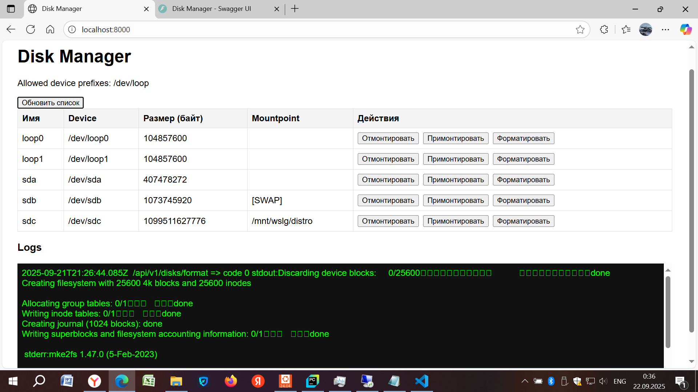
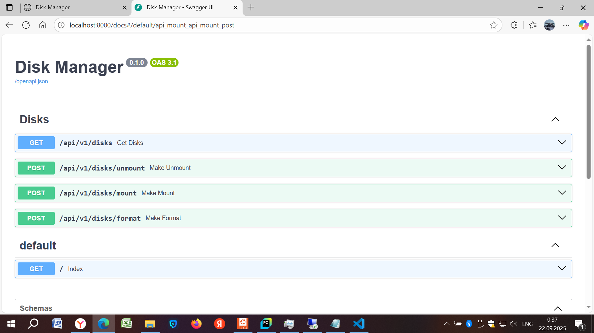

# disk-manager

Веб приложение на FastAPI,
с помощью которого можно управлять дисками виртуальной машины

## Локальный запуск

Из корневой папки проекта запустить команды (Проект использует **UV**, **Python 3.12**):

1. `uv venv -p 3.12`
2. `source .venv/bin/activate`
3. `uv sync`
4. _Optional: установить необходимые переменные окружения_
5. `uv run uvicorn --factory main:get_app --host 0.0.0.0 --port 8000`

### Список переменных окружения

- `ALLOWED_DEVICE_PREFIXES` - список допустимых префиксов имён устройств (например _/dev/loop_ или _/dev/sd_), разделённых запятыми, default: _/dev/loop_
- `ENABLE_DANGEROUS_PREFIXES` - флаг на разрешение опасных операций, default: _False_

### UI

### Swagger

Доступен по адресу `<host>/docs`

